# 👋 Hi, I'm Nouman Baig

### 🚀 Backend-Focused Software Engineer | AI & Cloud-Native Systems | Distributed Architecture | Microservices

I’m a **Backend-Focused Software Engineer with 5+ years of professional experience** designing, building, and deploying scalable software systems across **.NET, Python, AWS, Azure, microservices, APIs, distributed systems, and AI-powered applications**.

My engineering focus is simple:

> **Build backend systems that are reliable, scalable, secure, observable, and capable of solving real-world problems.**

I work primarily on backend architecture, API development, cloud-native systems, data-intensive applications, integrations, automation, and AI-enabled products.

Over the years, I’ve worked on systems ranging from **high-throughput APIs and microservices to IoT platforms, enterprise applications, data pipelines, carbon-footprint platforms, financial integrations, and AI-driven solutions**.

I enjoy taking complex requirements, breaking them into well-defined engineering problems, and turning them into maintainable production systems.

---

## 🧠 What I Build

I specialize in building systems around:

* 🏗️ **Backend & Distributed Systems**
* ⚡ **High-performance APIs**
* 🔌 **Microservices & Event-Driven Architecture**
* 🤖 **AI-powered applications & integrations**
* ☁️ **Cloud-native applications**
* 📊 **Data-intensive systems & ETL pipelines**
* 🔄 **Third-party & enterprise integrations**
* 📡 **Real-time systems & WebSockets**
* 🌐 **REST & GraphQL APIs**
* 🔐 **Secure authentication & authorization**
* 🚀 **CI/CD & cloud deployments**
* 🗄️ **SQL & NoSQL data platforms**
* 📈 **Scalable data processing**
* 🧪 **Automated testing & reliability engineering**

---

# 🛠️ Technology Stack

## 💻 Backend Engineering

### Languages


### Frameworks & Platforms


My backend work typically involves:

* RESTful API architecture
* GraphQL
* WebSockets
* Background processing
* Asynchronous programming
* Microservices
* API integrations
* Authentication & authorization
* Business logic
* Distributed services
* Performance optimization
* Data processing
* Error handling and observability

---

# ☁️ Cloud & Infrastructure

I have experience designing and deploying applications across **AWS and Microsoft Azure**, with a strong focus on cloud-native architectures.

## AWS


* EC2
* Lambda
* API Gateway
* S3
* SQS
* SNS
* DynamoDB
* EFS
* IoT Core
* IoT Greengrass
* Cloud-based application architectures

## Azure


* Azure Functions
* Azure App Services
* Azure AD
* Azure SQL
* Blob Storage
* Event Grid
* Azure Synapse
* Azure Service Bus
* Cloud-based data processing

---

# 🏗️ Architecture & Engineering

I’m particularly interested in designing systems that remain maintainable as they grow.

### Architecture Patterns

* Microservices Architecture
* Modular Monoliths
* Event-Driven Architecture
* Distributed Systems
* Serverless Architecture
* REST-based Services
* GraphQL
* Message-Based Communication
* Asynchronous Processing
* Background Workers
* API Gateway Architecture

### Engineering Principles

```text
Clean Architecture
        ↓
Separation of Concerns
        ↓
Well-defined APIs
        ↓
Testable Business Logic
        ↓
Reliable Data Access
        ↓
Observability
        ↓
Automated Deployment
        ↓
Production Reliability
```

I care about more than simply making software work.

I focus on:

**Correctness → Performance → Security → Maintainability → Scalability → Observability**

---

# 🤖 AI-Powered Engineering

AI is becoming an increasingly important part of modern software engineering, and I’m particularly interested in applying AI where it creates measurable value.

My interests include:

* AI-powered backend services
* LLM integrations
* AI automation
* Intelligent workflows
* AI-assisted developer tooling
* Natural language interfaces
* AI-driven data processing
* Intelligent decision-support systems
* AI + traditional backend architectures
* AI APIs and third-party model integrations

I see AI as another layer in the software architecture rather than something that replaces good engineering.

A typical AI-powered system might look like:

```text
User / Application
        ↓
API Gateway
        ↓
Backend Service
        ↓
Business Logic
        ↓
AI / ML Service
        ↓
Data / Knowledge Layer
        ↓
Response Processing
        ↓
Application
```

The interesting engineering challenge is making these systems **reliable, secure, observable, cost-efficient, and production-ready**.

---

# 📊 Data & High-Volume Systems

I enjoy working with systems where data volume, query performance, latency, and reliability actually matter.

Experience includes:

* Large datasets
* SQL optimization
* PostgreSQL
* SQL Server
* Redis
* DynamoDB
* NoSQL systems
* ETL pipelines
* Data transformation
* Parquet
* Apache Arrow
* AWS Glue
* Amazon Athena
* Azure Synapse
* PySpark
* S3-based data architectures

I’m particularly interested in the engineering trade-offs between:

```text
Latency
   ↕
Throughput
   ↕
Storage
   ↕
Cost
   ↕
Consistency
   ↕
Scalability
```

The right architecture depends on the problem.

---

# 🚀 Featured Engineering Projects

## 🏏 Cricket Simulator

### AI-powered cricket simulation and shot evaluation

An AI-based cricket simulator designed to evaluate cricket shots using machine learning and natural-language processing concepts.

**Technologies**

* Python
* CNN
* NLP
* Keras
* Machine Learning

🔗 [View Repository](https://github.com/noumannbaig/CricketSimulator)

---

# 🌱 GECCO2 – Carbon Footprint Platform

A cloud-based platform designed to help European industries understand, track, and reduce their carbon footprint.

The platform combines backend services, cloud infrastructure, computational processing, and modern frontend technologies.

### Architecture & Technologies

* C#
* .NET Core
* Python
* React
* AWS Lambda
* API Gateway
* MQTT
* TDE
* Cloud-based services

The interesting part of this system was not just building APIs.

It involved connecting multiple components into a platform capable of handling complex calculations, integrations, and production workloads.

---

# 🚉 Knorr-Bremse Digital Solutions

A cloud platform focused on railway and vehicle systems with real-time monitoring capabilities.

### Technologies

* .NET Core
* Azure
* Azure AD
* Azure Functions
* SQL
* CI/CD
* Kubernetes

The project involved working with enterprise-grade systems where reliability, authentication, deployment automation, and service architecture were critical.

---

# 📺 Windoxx Marketing Platform

An IoT-enabled advertising management platform for digital signage.

The system connected software services with physical devices and digital displays.

### Technologies

* .NET Core
* AWS IoT
* AWS IoT Greengrass
* MQTT
* Raspberry Pi
* Cloud services

This type of architecture required communication between cloud services, edge devices, and physical infrastructure.

---

# 🧑‍💼 HRMS – Human Resource Management System

A full-stack enterprise HR platform covering areas such as:

* Employee management
* Payroll
* Recruitment
* Compliance
* Internal workflows

### Technologies

* .NET Core
* Python
* Microservices
* React
* AWS EC2
* AWS RDS

The architecture combined multiple backend services with a web-based frontend and cloud infrastructure.

---

# 🎮 StayX Gameplay

A gamified platform designed around industrial workforce simulation and optimization.

### Technologies

* .NET Core
* Flutter
* WebSockets
* AWS SNS
* AWS SQS
* AWS Lambda

The project involved real-time communication and asynchronous cloud-based processing.

---

# 🔥 Engineering Interests

I'm especially interested in the following areas:

### Backend

```text
.NET
Python
FastAPI
Django
REST
GraphQL
WebSockets
Microservices
Distributed Systems
```

### Cloud

```text
AWS
Azure
Serverless
Cloud Architecture
Infrastructure
CI/CD
Docker
Kubernetes
Terraform
```

### Data

```text
PostgreSQL
SQL Server
Redis
DynamoDB
NoSQL
ETL
PySpark
Parquet
Athena
Synapse
```

### AI

```text
LLM Applications
AI APIs
AI Automation
Intelligent Workflows
AI-powered Backend Systems
Machine Learning
NLP
Computer Vision
```

---

# 🧪 Testing & Reliability

Production software isn't finished when the happy path works.

I care about how a system behaves when:

* Traffic increases
* Dependencies fail
* Data becomes inconsistent
* Requests arrive concurrently
* Services become unavailable
* Queues grow
* Queries become expensive
* External APIs fail
* Infrastructure restarts
* Unexpected input reaches the system

My testing experience includes:

* Unit Testing
* Integration Testing
* API Testing
* XUnit
* Pytest
* Mocking
* Edge-case testing
* Failure scenarios
* Regression testing

---

# 🔄 CI/CD & DevOps

I believe deployment should be an engineering process rather than a manual ritual.

Tools and technologies I've worked with include:


* Docker
* Kubernetes
* Jenkins
* Azure DevOps
* GitHub Actions
* Terraform
* Linux / Unix
* CI/CD pipelines
* Cloud deployments

---

# ⚡ Performance Engineering

One of my favorite parts of backend engineering is finding the bottleneck.

When a system is slow, I don't immediately add more infrastructure.

I ask:

```text
Where is the latency coming from?

        ↓

CPU?
Memory?
Database?
Network?
Disk I/O?
Serialization?
Lock contention?
External API?
Query plan?
Architecture?
```

Then I work backward from measurements rather than assumptions.

Areas I work with include:

* API latency
* Database optimization
* Query performance
* Caching
* Async processing
* Batch processing
* Connection management
* Distributed workloads
* High-throughput APIs
* Resource optimization

---

# 🔐 Security Mindset

Backend systems often sit directly between users, businesses, data, and infrastructure.

Security therefore needs to be part of the architecture.

Areas I work with include:

* Authentication
* Authorization
* Azure AD
* Secure APIs
* Secrets management
* Input validation
* Secure database access
* API security
* Encryption
* Secure cloud deployments

---

# 🌐 Frontend

Although my primary focus is backend engineering, I can work across the stack when required.

### Frontend Technologies


* React.js
* JavaScript
* HTML
* CSS
* Tailwind CSS
* Chakra UI
* Figma
* Adobe XD

My preferred approach is to keep the frontend focused on presentation and user experience while keeping business logic and complex processing where it belongs: the backend.

---

# 🧩 How I Approach Engineering Problems

I generally approach a complex problem through a few simple stages.

### 01 — Understand

First, understand the actual problem rather than immediately choosing a technology.

### 02 — Decompose

Break the problem into:

```text
Requirements
↓
Services
↓
Data
↓
Interfaces
↓
Dependencies
↓
Failure Scenarios
```

### 03 — Design

Choose the simplest architecture that can satisfy the requirements.

### 04 — Build

Implement clean, testable, maintainable components.

### 05 — Measure

Use logs, metrics, profiling, and real behavior to identify bottlenecks.

### 06 — Improve

Optimize only where optimization actually matters.

---

# 🧠 Engineering Philosophy

```text
Simple systems are easier to understand.

Well-defined boundaries are easier to maintain.

Measured performance beats assumed performance.

Good architecture makes change cheaper.

Tests protect behavior.

Automation reduces human error.

Observability turns production problems into engineering problems.

AI is powerful, but good engineering still matters.
```

---

## 📊 GitHub Analytics

<div align="center">




</div>

<br>

<div align="center">


</div>
---

# 💻 Current Focus

I'm currently interested in building and exploring:

```text
AI + Backend Engineering
        +
Cloud-Native Architecture
        +
Distributed Systems
        +
Data-Intensive Applications
        +
Developer Automation
```

Especially systems where **AI, APIs, cloud infrastructure, and data processing come together**.

---

# 🌍 Languages

* 🇬🇧 English — Professional
* 🇩🇪 German — A1

---

# 🤝 Let's Build Something

I'm interested in working on challenging engineering problems involving:

* Backend systems
* AI integrations
* Cloud architecture
* Microservices
* APIs
* Distributed systems
* Data platforms
* Automation
* SaaS products
* Enterprise applications
* Real-time applications

If you're building something interesting, I'd be happy to talk.

---

# 📫 Connect With Me

<p align="left">

<a href="mailto:nomanbaig290@gmail.com">

</a>

<a href="https://www.linkedin.com/in/nouman-baig-3893441b6/">

</a>

<a href="https://github.com/noumannbaig">

</a>

</p>

---

<div align="center">

### ⚡ Build. Automate. Scale. Repeat.

**Backend Engineering • Cloud • AI • Distributed Systems**

</div>
